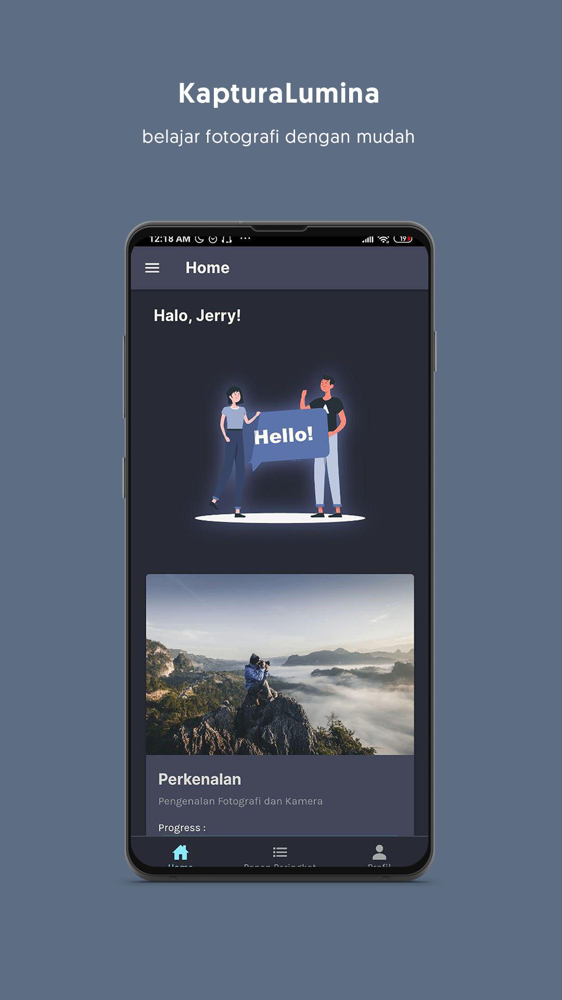
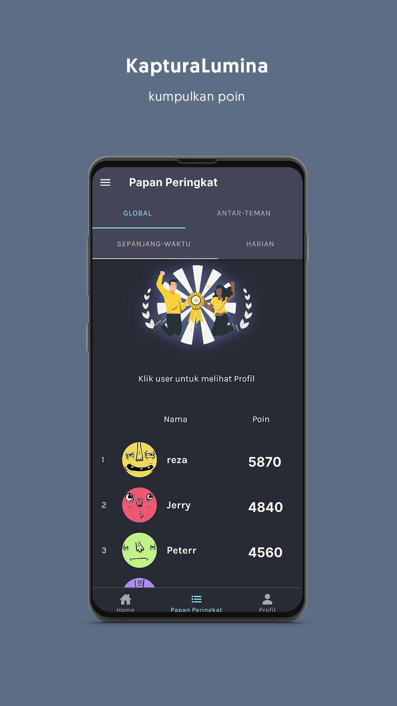
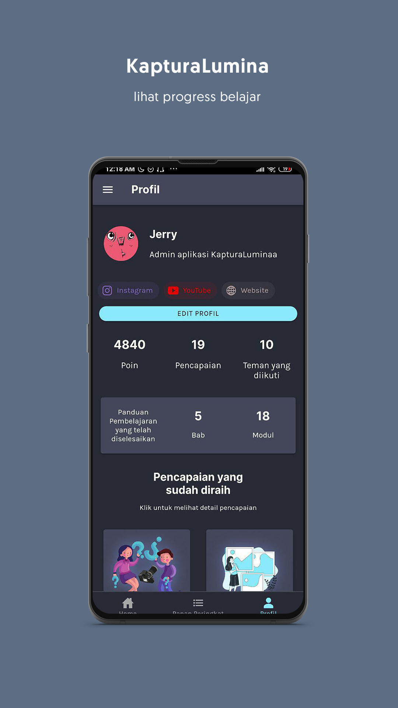
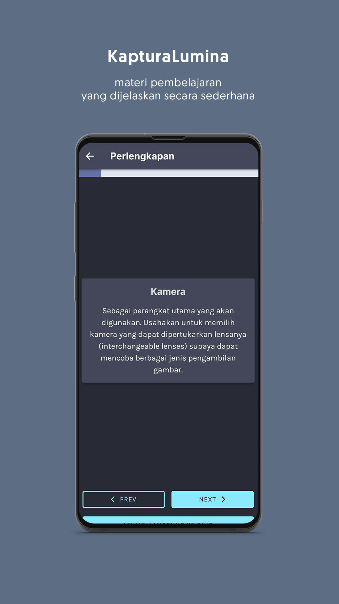
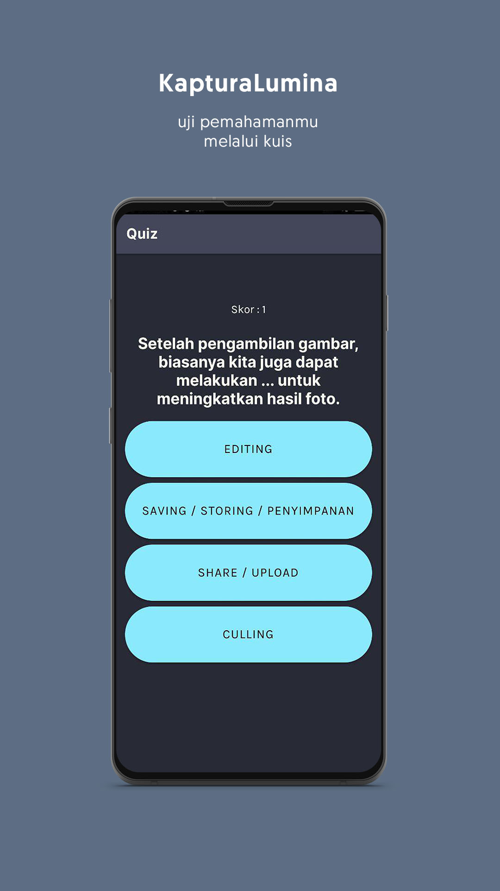

# KapturaLumina

Basic Photography Learning Mobile Applications with Gamification

Bachelor Thesis (Final Project) of [Agustinus Nathaniel](https://agustinusnathaniel.com)

## Previews

Home Page | Leaderboard | Profile
:-------------------------:|:-------------------------:|:-------------------------:
 |  | 
Learn | Quiz | 
 |  | 

App Theme color inspired by Dracula Theme color palette

## Tech Stacks, Dependencies
* Framework : Ionic v5 - React
* Database + Auth : Firebase
* Tools, Libraries : 
  - Ionic Capacitor
  - TypeScript
  - Cloudinary for image storage
  - CloudImage for image resizing, compression, (image transformer) and acceleration / optimization
* Deployment : Vercel (Formerly Zeit) for PWA (Web App) Version

* some dependencies
  - `@ionic-native/app-minimize`
    Why? So the problem started when I build the app into capacitor-android. The hardware back button behavior in Capacitor Android Ionic React app is a bit annoying and mostly it made the app crashed. So I try to find a way how to fully disable the android hardware back button in this app. Found Capacitor App API and I use it to make the app exit when push the android hardware button. But it ruins the user experience of the app. So I try to think another alternative. I thought why don't I just make the app minimize. Turned out there was a plugin to minimize the app, so that's how I end up using this plugin... Quite a story but I learned so much and have fun.

  
<strong>Getting Started</strong>

  
  ## Getting Started
  * [Download](https://nodejs.org) and install node.js
  * Install ionic CLI : 
    `npm install -g ionic`
  * Clone this repo
    `git clone https://github.com/sozonome/kapturalumina.git`
  * Run `npm i` or `yarn` from project root
  * Important
    - Setup a Firebase console
    - Put the required keys in `.env` (see [.env_sample](https://github.com/sozonome/kapturalumina/blob/master/.env_sample))
    - Set up the [Auth and Database](#SettingUptheFirebase)
  * Run `ionic s`

  ## SettingUptheFirebase
  In order for the application to run, you will need to connect it to Firebase Auth and Database. The specified database structure are included in the [models](https://github.com/sozonome/kapturalumina/blob/master/src/models/learnModules.tsx).

  
<strong>Build Guide</strong>

  ## General Build Guide
  * `npm run build-release-android` or `npm run build-clean-release-android`

  ## Build to APK Guide
  1. `npm run build-release-android`,
  2. `npm run debug-android`, wait until Android Studio Open and finish setting up Gradle etc
  3. Clean Project + Rebuild Project if needed
  4. Go to Build > Generate Signed Bundle / APK 
  5. Put in the password of the KeyStore
  6. Done

  
<strong>References, Notes</strong>

  ## References
  ##### Some references and problems I encounter during development and I think will be helpful for my next projects
  - [Ionic](https://ionicframerwork.com/)
    - [Ionic Docs](https://ionicframework.com/docs/react) 
    - [Ionic + React + Firebase Tutorial](https://www.youtube.com/playlist?list=PLYxzS__5yYQlhvyLXSKhv4oAvl06MInSE)
    - [Change Font](https://commentedcoding.com/how-to-create-a-settings-page-with-customizable-font-family-in-ionic-5-steps/)
    - [Theming](https://ionicframework.com/docs/theming/themes)
    - [Colors - Color Generator](https://ionicframework.com/docs/theming/colors)
    - Hardware Back Button Android Problem
      - [Hardware Back Button Android Problem - Android](https://ionicframework.com/docs/developing/hardware-back-button)
      - [Hardware Back Button Android Problem - Android](https://forum.ionicframework.com/t/react-handle-hardware-back-button/183566/3)
        <pre><code>setupConfig({
          swipeBackEnabled: false,
          hardwareBackButton: false, //android
        });</code></pre>
      - [React Config](https://ionicframework.com/docs/react/config)
        - [Capacitor App API - Add listener back button](https://capacitor.ionicframework.com/docs/apis/app/)
        - [App Minimize](https://ionicframework.com/docs/native/app-minimize)
  - [Environment Variables](https://www.youtube.com/watch?v=17UVejOw3zA)
  - [Firebase](https://firebase.google.com/)
    - [React Auth with Firebase and Hooks](https://www.youtube.com/watch?v=unr4s3jd9qA)
    - [Manage Users](https://firebase.google.com/docs/auth/web/manage-users)
    - [Realtime Database Read and Write](https://firebase.google.com/docs/database/web/read-and-write)
  - [Persistent Login](https://www.youtube.com/watch?v=2Oz-OLB8FQQ)
  - [Capacitor](https://capacitor.ionicframework.com/docs/)
  - [Android App Version Number](https://www.freakyjolly.com/change-version-number-of-app-in-android-studio/#.XtM01TPiuHs)

